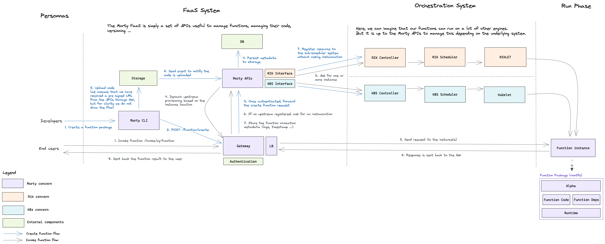

# Improve overall Morty architecture

- [Improve overall Morty architecture](#improve-overall-morty-architecture)
  - [Summary](#summary)
    - [Issue](#issue)
    - [Decision](#decision)
    - [Status](#status)
  - [Details](#details)
    - [Assumptions](#assumptions)
    - [Constraints](#constraints)
    - [Positions](#positions)
    - [Argument](#argument)
    - [Implications](#implications)
    - [Architecture overview](#architecture-overview)
  - [Notes](#notes)

## Summary

### Issue

We currently have a MVP of our FaaS platform, Morty. The MVP is good enough to fill in the first use cases requirements, but as we added more and more code to achieve this first milestone, we have introduced some architectural issues that we need to rework before adding features to our platform.

- Morty is too much coupled with RIK. We rely on RIK for storing function metadata and other information. 
  
- We don't have a real API Gateway to serve our functions. The current API Gateway is simply a controller for our FaaS system, and we cannot easily add functions instances into it (we ask RIK to give us the function location).

### Decision

Decided on make Morty and RIK loosely coupled, and implement a simple API Gateway with dynamic upstream provisioning embedded.

RIK should be able to orchestrate **containers** and **virtual machines** only. As we defined that functions are simply custom VM image (rootfs), RIK should not make a difference between an Ubuntu VM image and a function. And in the same way RIK pulls container images, it must be able to pull VM images.

The new API Gateway will need to implement a set of management APIs to dynamically provision / remove upstreams.

### Status

Decided. Open to considering to new capabilities as they come up.

## Details

### Assumptions

We favor defining a clear responsibilities seggregation between Morty and Rik. We assume that to be able to work properly, Morty will need to use a RIK cluster to run functions inside RIK virtual machines. Why do we need to clearly define a boundary ? We can simply imagine that one day, we want to add the capability to Morty to schedule functions on another engine, such as Kubernetes, AWS EC2, Google Compute Engine etc. I'm ok with the fact that we will probably not implement a such capability. But in terms of software design, it is always better to think about those cases to implement a modular architecture that will not require a lot of rework to add more and more features.

Concerning the API Gateway, we wonder something that is responsible for proxying requests on an underlying service. Here a service can be a micro-service, a function, a website etc. 

### Constraints

- RIK should be able to schedule virtual machines `VM` in the same way that it is able to schedule containers.

- API Gateway should have a management API for managing dynamic upstreams. We need to be able to provision a new route into the gateway, without restarting it.

### Positions

For RIK, we added a workload kind `Function`.

For the API Gateway, we considered a few approaches : 

- Make something that acts as an entrypoint (or a front-end) to handle function invocations. **(Currently in use)**

- Use an existing API Gateway, [Apache Apisix](https://github.com/apache/apisix) or similar.

- Develop our own API Gateway.

### Argument

For RIK, we decided to rename the `Function` kind into `VM` : 

- RIK will now be completely agnostic about what kind of VM it will schedule. 
- RIK will download VM images, and will not care about the content of those images.

For the API Gateway, we decided to develop our own API Gateway. 

- Simple to implement reverse proxying in most of the current languages (Rust, Go). 

- We can easily implement a management API.

- No need for an additional knowledge about a tool and no additional operational complexity. 

- We will be able to easily add business logic into our API.

### Implications

- Develop a new service, the API Gateway
- Keep the actual API Gateway but rename it Morty Controller (I'm not closed to any other name). This component should keep a state up to data with all the functions on the platform.
- Make minor changes to RIK

### Architecture overview

Below a schema detailing the overall architecture at the end of the rework : 

**In the above schema, there is a `Morty APIs` component. This can be one service or a set of micro-services, but we don't care about the technical implementation here.**

## Notes

I am aware that we don't have a lot of time for the project, and that we will need to work on the artificial intelligence part very soon. But I'm very confident about the fact that we can implement all the things described in this document in a short time.

Finally, in the same way that Morty uses RIK as a component, I think that PolyxIA will use Morty to manage the intent handlers. But keep in mind that, the same way we want to clearly have a boundary between Morty and RIK, PolyxIA should be designed in a way that we can easily replace the PolyxIA serverless engine by AWS Lambda or Google Cloud Functions for example.
